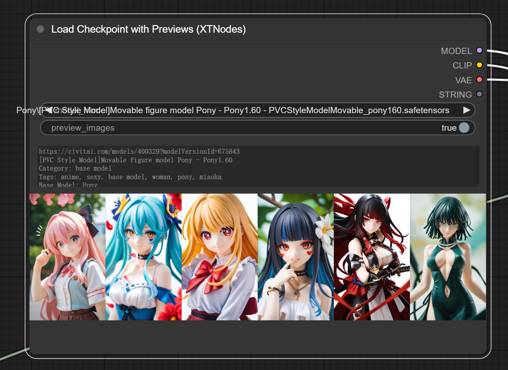
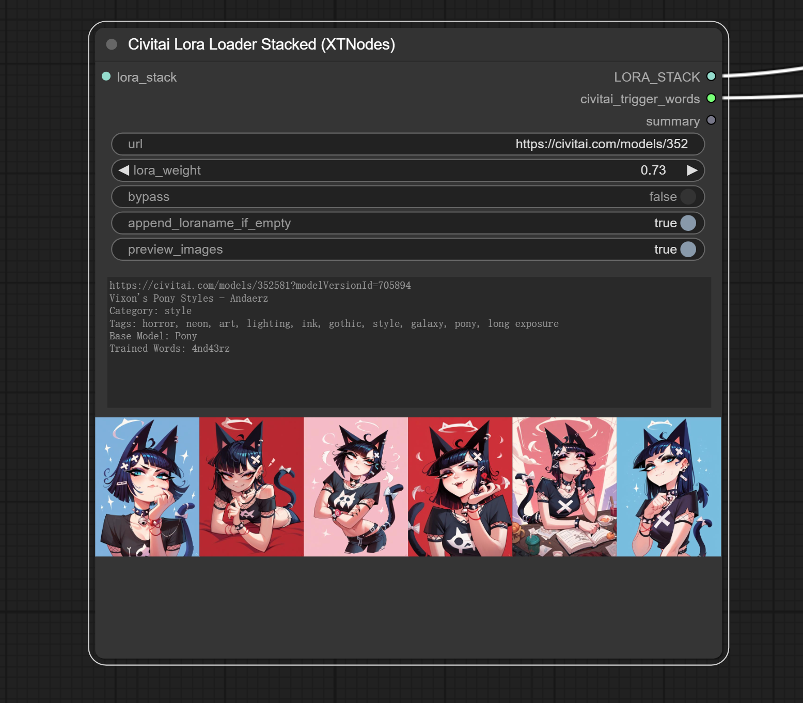

# ComfyUI Easy Civitai (XTNodes)


**Fed up with the hassle of managing AI models and LoRAs?** Tired of hunting down the perfect resources, only to struggle with getting them loaded and configured just right? 

**Introducing the Civitai Node Loading System**—your all-in-one solution for seamless model and LoRA management. Whether you’re pulling directly from Civitai or loading from local files, our system makes it a breeze. With automatic preview generation and BLAKE3 hash verification, you can be sure that you’re always working with the correct and highest quality resources. Say goodbye to the guesswork and hello to a streamlined, efficient workflow that’s as powerful as it is user-friendly.

------
### Example Workflow:
Thanks "Yox Rider" for the example workflow.

https://openart.ai/workflows/seal_noxious_47/load-a-civitai-model-directly-from-url-with-previews-lora-checkpoint-lora-stack/YRaCFjCDxDepmBbI8r4R

https://openart.ai/workflows/seal_noxious_47/load-model-with-previews-lora-checkpoint-lora-stack/k7g45npgYRVSmtDbce2b

------
### Node Examples:

#### **1. Load Checkpoint with Previews (XTNodes)**

[](./assets/CheckPointLocal.png)

**Description**:
This node allows users to load model checkpoints from a local file. When using a local file, the system calculates the BLAKE3 hash to search for the corresponding model on Civitai. The node also provides image previews to help users confirm the loaded model.

**Input Types**:

- **model_name** (`STRING`):
  - Description: The name of the model checkpoint file.
  - Source: Local file name.
- **preview_images** (`BOOLEAN`):
  - Description: A flag indicating whether to generate image previews.
  - Default: `True`

**Output Types**:

- MODEL:

  - Description: The loaded model checkpoint.

- CLIP:

  - Description: The CLIP model associated with the checkpoint.

- VAE:

  - Description: The VAE model linked with the checkpoint.

- summary(Text):

  - Description: A textual summary of the model, including its description and metadata.

------

#### **2. Civitai LoraLoaderStacked (XTNodes)**

[](./assets/LoraStackUrl.png)

**Description**:
This node is designed for stacking multiple LoRAs, loaded either directly from Civitai using URLs or from local files. It supports custom configuration for LoRA weights and includes preview functionality. When using local files, the system calculates the BLAKE3 hash to verify the models against Civitai.

**Note**: The Lora Stack is also compatible with custom nodes from the [Comfyroll CustomNodes repository](https://github.com/Suzie1/ComfyUI_Comfyroll_CustomNodes), providing additional flexibility and customization options.


**Input Types**:

- **url** (`STRING`):
  - Description: The URL of the LoRA model on Civitai.
  - Default: `"https://civitai.com/models/352581?modelVersionId=705894"`
  - Note: This input is used when loading directly from Civitai.
- **lora_weight** (`FLOAT`):
  - Description: The weight applied to the LoRA model.
  - Default: `1.0`
  - Range: `-10.0` to `10.0`
- **bypass** (`BOOLEAN`):
  - Description: A flag to bypass the loading of the LoRA, useful for selectively applying stacked configurations.
  - Default: `False`
- **append_loraname_if_empty** (`BOOLEAN`):
  - Description: If no trigger words are found, this flag determines whether to append the LoRA name as a fallback.
  - Default: `False`
- **preview_images** (`BOOLEAN`):
  - Description: A flag indicating whether to generate image previews.
  - Default: `True`
- **lora_stack** (`LORA_STACK`):
  - Description: An optional input for stacking multiple LoRAs.

**Output Types**:

- LORA_STACK:

  - Description: The final stack of LoRAs after applying the specified configurations.

- civitai_trigger_words:

  - Description: A list of trigger words associated with the loaded LoRAs.

- summary(Text):

  - Description: A textual summary of the LoRA stack, including relevant metadata and descriptions.

### All Nodes:

- **Civitai Checkpoint Loader (XTNodes)**
- **Civitai Lora Loader (XTNodes)**
- **Civitai Lora Loader Stacked (XTNodes)**
- **Civitai Lora Loader Stacked Adv(XTNodes)**
- **Load Checkpoint with Previews (XTNodes)**
- **Load Lora with Previews (XTNodes)**
- **Load Lora Stacked with Previews (XTNodes)**
- **Load Lora Stacked Advanced with Previews (XTNodes)**

All nodes are in folder `loaders` .

**Note**: The Lora Stack is also compatible with custom nodes from the [Comfyroll CustomNodes repository](https://github.com/Suzie1/ComfyUI_Comfyroll_CustomNodes), providing additional flexibility and customization options.


------

### Usage

#### Linux Users: 

If you're on Linux, please manually install `aria2c` to ensure the system functions correctly.

**Ubuntu/Debian:**

```bash
sudo apt-get update
sudo apt-get install aria2
```
After installation, you can verify that aria2c is installed correctly by running:

```bash
aria2c --version
```

#### Method A: Install via ComfyUI Manager

1. Install the ComfyUI Manager: https://github.com/ltdrdata/ComfyUI-Manager.
2. Open ComfyUI Manager.
3. Search for "ComfyUI Easy Civitai (XTNodes)".
4. Install directly through the manager.
5. Config.

#### Method B: Manual Installation

1. Clone the repository:

   ```
   git clone https://github.com/X-T-E-R/ComfyUI-EasyCivitai-XTNodes
   ```
   
2. Install the required dependencies:

   ```
   pip install -r requirements.txt
   ```
3. Config.

#### Config

After installation, you need to configure the system by modifying two configuration files:

   - **`settings.toml`**: This file contains general settings for the application.
   - **`.secrets.toml`**: This file, initially provided as `.secrets.toml.example`, needs to be copied and renamed to `.secrets.toml`. You will need to configure your API token in this file.

   **Note**: An API token is required to download some NSFW models from Civitai.

Make sure all necessary configurations are set up correctly to enable full functionality of the nodes.


------

### Features:

- **Automatic Preview Generation**: All nodes are equipped with a preview functionality that generates visual previews of the loaded models or LoRAs, ensuring that users can quickly verify the resources they are working with.
- **BLAKE3 Hash Verification**: When loading from local files, the system automatically computes the BLAKE3 hash of the file. This hash is used to search and verify the model against the Civitai database, providing an additional layer of accuracy and convenience.
- **Seamless Civitai Integration**: Whether loading models directly from URLs or local files, our nodes are fully integrated with Civitai, ensuring that all resources are properly referenced and verifiable.

This system is ideal for users who require a reliable and efficient workflow for managing AI resources, with the added benefit of previewing and verifying models to ensure the highest quality results.


### Credits

I want to extend my heartfelt thanks to the incredible libraries that are the backbone of this project:

- **aria2**
- **blake3**
- **sanitize_filename**
- **pydantic**
- **dynaconf**
- **codetiming**

A special thanks also goes to the [ComfyUI-Lora-Auto-Trigger-Words](https://github.com/idrirap/ComfyUI-Lora-Auto-Trigger-Words) project, which inspired key aspects of our implementation. Your work provided a valuable foundation and guidance, and for that, we are truly grateful.

